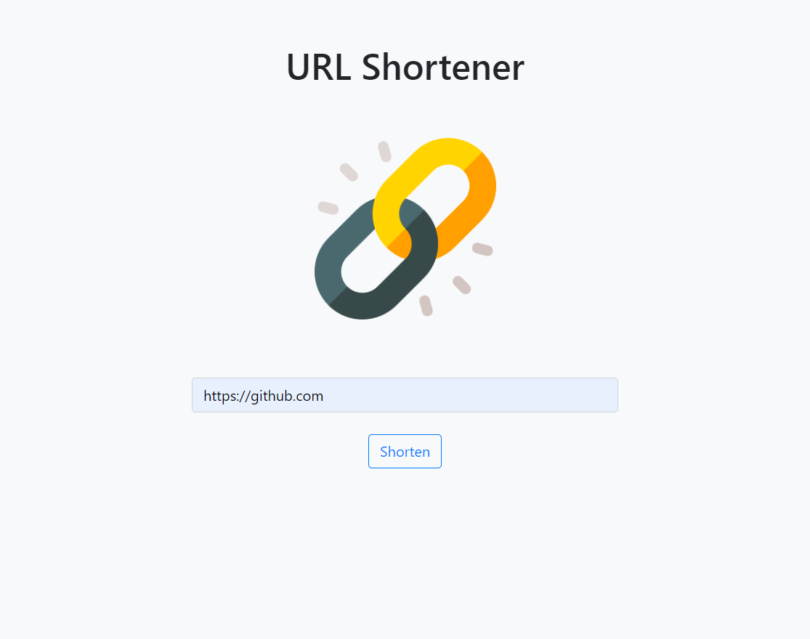
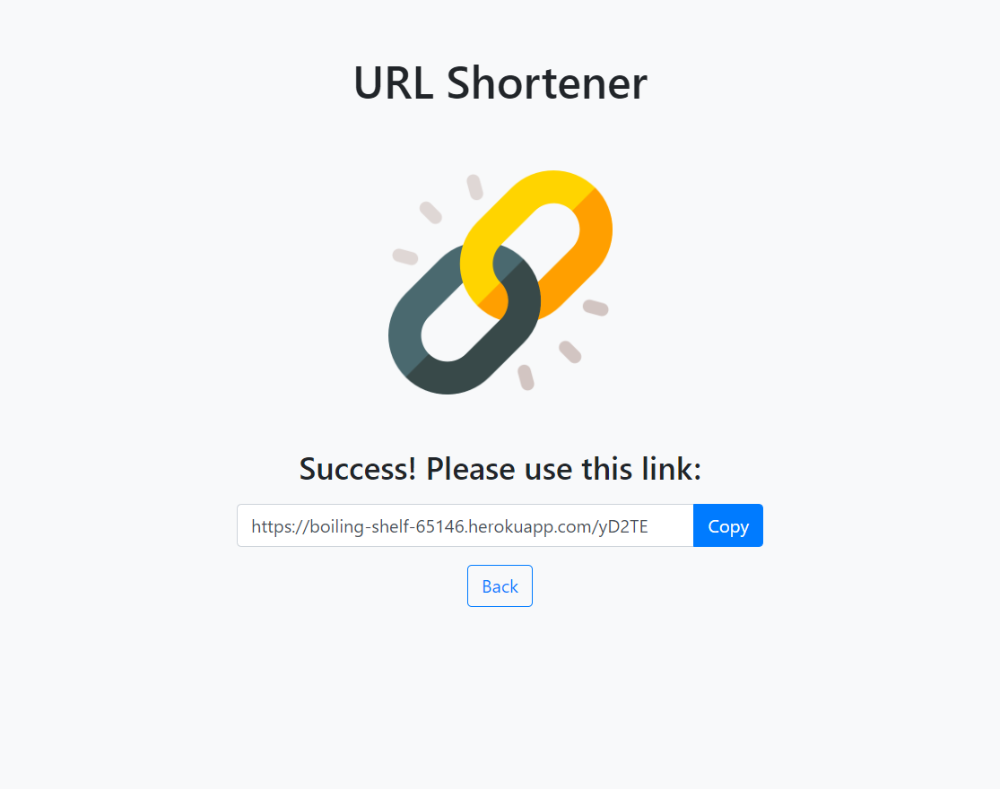
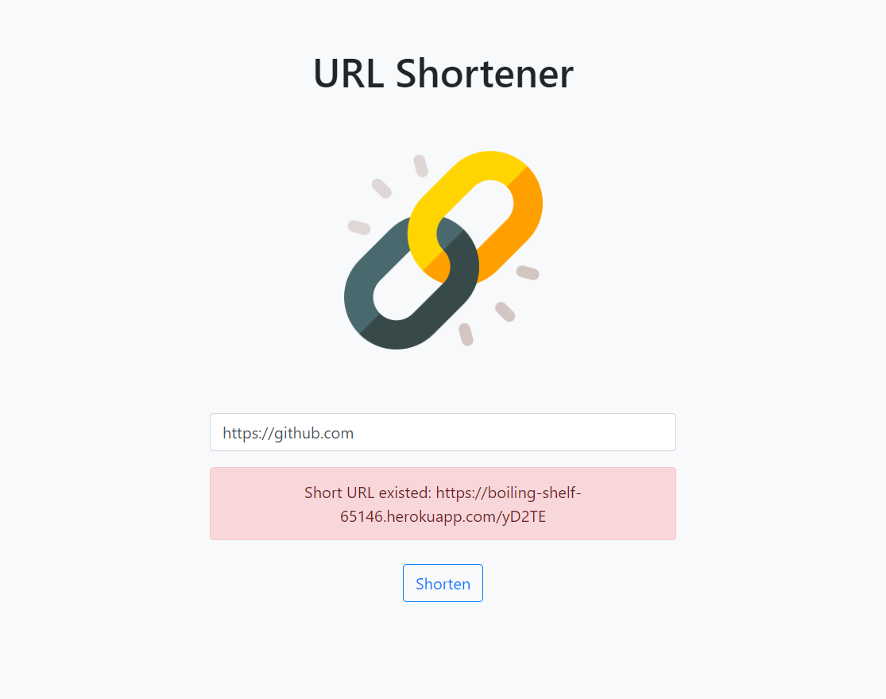
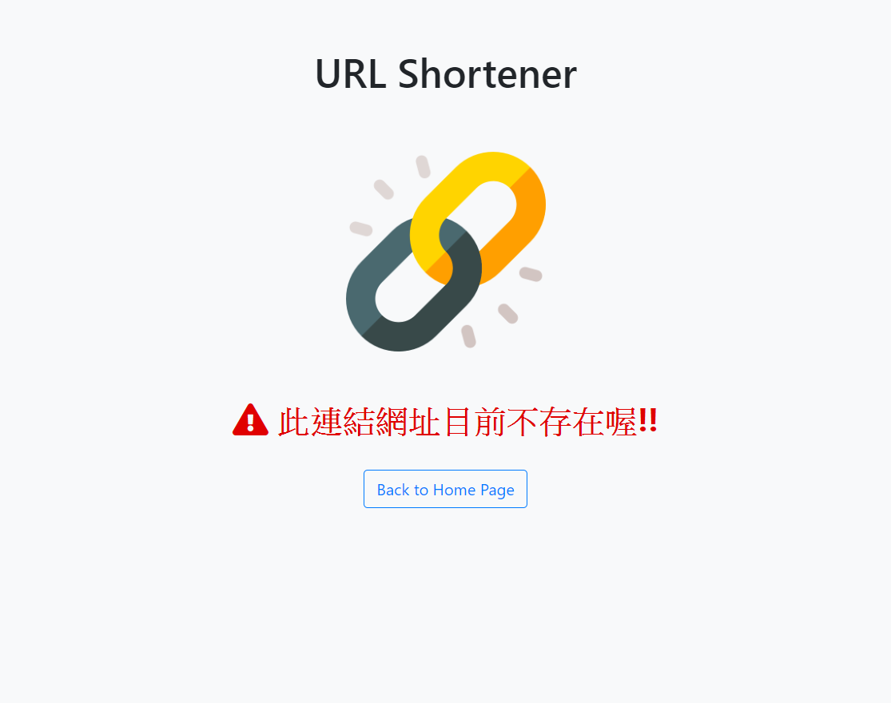

# URL Shortener 短網址產生器 

使用 Node.js 、 Express框架 、 MongodDB 的練習作品，可將輸入的原始網址轉換成短網址。







## Features

* 首頁畫面上有一個表單，使用者可以在表單輸入原始網址，如 https://www.google.com；送出表單之後，畫面會回傳格式化後的短網址，如 https://your-project-name.herokuapp.com/6y7UP
* 在伺服器啟動期間，使用者可以在瀏覽器的網址列，輸入你提供的短網址（如 https://your-project-name.herokuapp.com/6y7UP），瀏覽器就會導向原本的網站（如 https://www.google.com）
* 使用者可以按 Copy 來複製縮短後的網址

## Link to the Page

[=> URL Shortener](https://boiling-shelf-65146.herokuapp.com/)

## Installing to Local Computer

1. 終端機輸入
```
git clone https://github.com/Mia-Chen-taiwan/URL-shortener.git
```

2. 安裝套件
```
npm install
```

3. 執行
```
npm run dev
```

## Built With & Tools

* Express framework
* Express-handlebars
* body-parser
* mongoose
* CDN include Bootstrap, jQuery, Popper.js and fontawesome